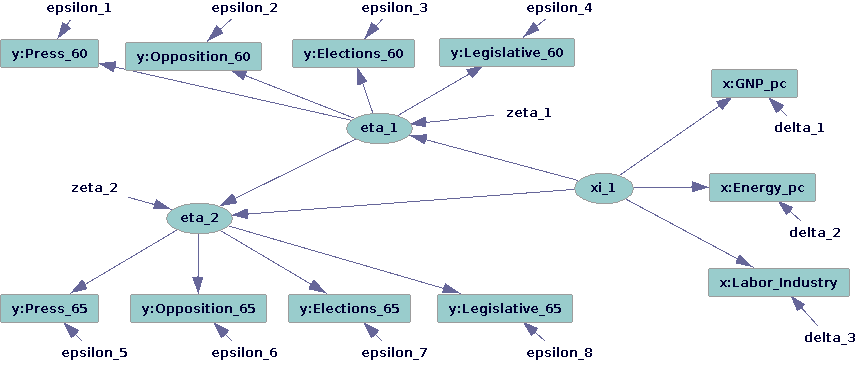
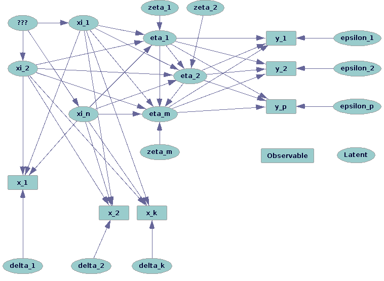

<style type="text/css">
slides > slide:not(.nobackground):after {
  content: '';
}
</style>

```{r setup, include=FALSE}
library(knitr)
library(rstan)
options(mc.cores = parallel::detectCores())
```

## Obligatory Disclosure

* Ben is an employee of Columbia University, which has received several research grants to develop Stan and
  is currently [seeking](http://andrewgelman.com/2018/01/22/big-data-needs-big-model-2/) an additional $10 million
* Ben is also a manager of GG Statistics LLC, which uses Stan for business purposes
* According to Columbia University 
  [policy](https://research.columbia.edu/content/conflict-interest-and-research), any such employee who 
  has any equity stake in, a title (such as officer or director) with, or is expected to earn at least 
  $\$5,000.00$ per year from a private company is required to disclose these facts in presentations

## Outline

* Review structural equation models (SEM) with latent variables using the parameterization in the LISREL software
* Preview a subset of the Stan language needed to implement a model like this
* Call Stan from R to draw from the posterior distribution in one example
* Analyze the Stan output

## Directed Acyclic Graph from [Bollen (2014)](https://books.google.com/books?id=DPBjBAAAQBAJ&lpg=PP1&dq=editions%3A_jvaHQQxxkcC&pg=PP1#v=onepage&q&f=false)



## Directed Acyclic Graph with Latent Variables 



## Linear Structural Equation Models

- $\boldsymbol{\xi}$ ("xi") is a $n$-vector of latent exogenous variables with expectation zero
- $\boldsymbol{\eta}$ ("eta") is a $m$-vector of latent endogenous variables with expectation zero
- $\mathbf{B}$ (capital "beta") is a strictly lower-triangular matrix, implying
in scalar algebra that $\eta_{j}=\sum_{i=1}^{j-1}B_{ij}\eta_{i}+\sum_{i=1}^{n}\Gamma_{ij}\xi_{i}+\zeta_{j}\,\forall j$,
where $\boldsymbol{\Gamma}$ ("Gamma") is a matrix of coefficients and $\boldsymbol{\zeta}$ ("zeta") is an exogenous $m$-vector of structural errors in $\boldsymbol{\eta}$. In matrix algebra, we have the structural form
  $\boldsymbol{\eta} = \mathbf{B} \boldsymbol{\eta} + \boldsymbol{\Gamma} \boldsymbol{\xi} + \boldsymbol{\zeta}$ and
  the reduced form
  $\boldsymbol{\eta} = \mathbf{A} \boldsymbol{\Gamma} \boldsymbol{\xi} + \mathbf{A} \boldsymbol{\zeta}$ where     $\mathbf{A}=\left(\mathbf{I}-\mathbf{B}\right)^{-1}$.
- Furthermore, we have a measurement model for the $q$-vector of known (centered) exogenous variables 
  $\mathbf{x} = \boldsymbol{\Lambda}_x \boldsymbol{\xi} + \boldsymbol{\delta}$ with coefficient matrix 
  $\boldsymbol{\Lambda}_x$ ("Lambda-x") and one for the $p$-vector of known (centered) endogenous variables 
  $\mathbf{y} = \boldsymbol{\Lambda}_y \boldsymbol{\eta} + \boldsymbol{\epsilon}$ with
  coefficient matrix $\boldsymbol{\Lambda}_y$ ("Lambda-y") where the measurement errors $\boldsymbol{\delta}$ and $\boldsymbol{\epsilon}$ are uncorrelated with everything
- These assumptions imply that the covariance matrix of multivariate normal known variables has a known structure
  that depends only on parameters
  
## Identifying Restrictions

- Latent variables have no units, so you either have to fix some element in each column of 
  $\boldsymbol{\Lambda}_x$ and $\boldsymbol{\Lambda}_y$ or better, fix the variance of the latent variable to
  be 1
- The latter normalization implies that $\boldsymbol{\Psi}$ is the _correlation_ matrix among $\boldsymbol{\zeta}$
  and $\boldsymbol{\Phi}$ is the _correlation_ matrix among $\boldsymbol{\xi}$
- Still, you can multiply any column of $\boldsymbol{\Lambda}_x$ or $\boldsymbol{\Lambda}_y$ by $-1$ and multiply the
  corresponding latents by $-1$ without changing the implied covariance of the observed variables
- To avoid this, we fix the _sign_ of one element in each column of $\boldsymbol{\Lambda}_x$ and 
  $\boldsymbol{\Lambda}_y$
- Traditionally, several elements of each column of $\boldsymbol{\Lambda}_x$ and $\boldsymbol{\Lambda}_y$ are
  fixed to zero; under the Bayesian approach this is not strictly necessary because you should
  have a prior (often centered at zero) for these coefficients
- But if the priors are too weak, you can run into computational problems where the order of the latent
  variables can switch

## Skeleton Matrices {.smaller}
  
- In R, we can represent these restrictions with "skeletons" such as where `NA` means free, $\pm \infty$
  means free subject to a sign constraint, and any finite number means fixed to that number
```{r, include = FALSE}
Lambda_y <- matrix(NA_real_, nrow = 8, ncol = 2)
colnames(Lambda_y) <- c("dem60", "dem65")
rownames(Lambda_y) <- c("press60", "opposition60", "elections60", "legislature60",
                        "press65", "opposition65", "elections65", "legislature65")
Lambda_y[3, 1] <- Inf
Lambda_y[7, 2] <- Inf
Lambda_y[1:4, 2] <- 0
Lambda_y[5:8, 1] <- 0

Lambda_x <- matrix(NA_real_, 3, 1)
rownames(Lambda_x) <- c("GNP_pc", "energy_pc", "work_industry")
colnames(Lambda_x) <- "industrialization"
Lambda_x[3,1] <- Inf

Gamma <- matrix(NA_real_, 2, 1)
rownames(Gamma) <- colnames(Lambda_y)
colnames(Gamma) <- colnames(Lambda_x)

B <- matrix(0, 2, 2)
rownames(B) <- colnames(B) <- colnames(Lambda_y)
B[2,1] <- NA_real_
```
<div class="columns-2">
```{r}
Lambda_y
Gamma
B
Lambda_x
```
</div>

## Bayesian Approach

* Bayes' Rule in log form, where $f\left(\cdot\right)$ indicates a possibly conditional PDF
$$\ln f\left(\left.\boldsymbol{\Lambda_y},\boldsymbol{\Lambda_x},\boldsymbol{\Gamma},\mathbf{B},
  \boldsymbol{\Theta}_{\epsilon},\boldsymbol{\Theta}_{\delta}\right|\mathbf{S}\right) = 
  \ln f\left(\boldsymbol{\Lambda_y},\boldsymbol{\Lambda_x},\boldsymbol{\Gamma},\mathbf{B},
    \boldsymbol{\Theta}_{\epsilon},\boldsymbol{\Theta}_{\delta}\right) + \\
  \ln f\left(\left.\mathbf{S}\right|\boldsymbol{\Lambda_y},\boldsymbol{\Lambda_x},\boldsymbol{\Gamma},\mathbf{B},
    \boldsymbol{\Theta}_{\epsilon},\boldsymbol{\Theta}_{\delta}\right) -
  \ln f\left(\mathbf{S}\right)$$
* By specifying the first two terms on the right-hand side, Stan can draw from the distribution whose log-PDF is the 
  left-hand side
* This defines a probability distribution for what you should believe about the parameters given
  your data as opposed to the frequentist probability distribution for a point estimator of the parameters over all
  possible samples that could have been drawn from a well-defined population
* There are essentially no cases with a differentiable posterior PDF where other Bayesian software works well &
  Stan works poorly, but the converse happens
  

## Stan Language {.smaller}

* Writing in Stan is like writing a subset of C++, so types have to be declared and statements end in `;`
* The only primitive types in Stan are `int` and `real` and unknowns cannot be integers
* In addition, can declare a `vector[size] x` or `matrix[rows, columns] X` that contain `real` numbers
* There are some matrix specializations like `cov_matrix[order] S` and `cholesky_factor_corr[order] L_Phi`
* Can use arrays, which are like homogenous lists of other objects
* An entire Stan program is organized in blocks (some of which are optional) that must appear in the following order:
    1. `functions` (optional) where you can define functions to be called later in the Stan program
    2. `data` where you declare objects that will be passed as a named list from R
    3. `transformed data` (optional) where you define objects that will be used in subsequent blocks
    4. `parameters` where you declare the parameter space (possibly with inequalities) of all the unknowns
    5. `transformed parameters` (optional) where you define intermediates of interest
    6. `model` where you build up the kernel of the posterior density in log-units
    7. `generated quantities` (optional) where you define objects of interest that are not needed for the log-kernel
    

## `data` Block of a Stan Program

```{r, comment = NA, echo = FALSE}
writeLines(readLines(file.path("src", "stan_files", "LERSIL.stan"))[51:68])
```

## `parameters` Block of a Stan Program

```{r, comment = NA, echo = FALSE}
writeLines(readLines(file.path("src", "stan_files", "LERSIL.stan"))[166:182])
```

## `transformed parameters` Block of a Stan Program

```{r, comment = NA, echo = FALSE}
writeLines(readLines(file.path("src", "stan_files", "LERSIL.stan"))[183:192])
```

where `fill_matrix` is defined (not shown) in the `functions` block at the start of the Stan program.
You can expose these user-defined Stan functions to R using `rstan::expose_stan_functions(filename)`.

## `model` Block of a Stan Program {.smaller}

```{r, comment = NA, echo = FALSE}
writeLines(readLines(file.path("src", "stan_files", "LERSIL.stan"))[193:215])
```

## `generated quantities` Block of a Stan Program

```{r, comment = NA, echo = FALSE}
writeLines(readLines(file.path("src", "stan_files", "LERSIL.stan"))[227:239])
```
and it then draws from the posterior distribution of $\boldsymbol{\eta}$ and $\boldsymbol{\xi}$ if
the raw data are available. One of the advantages of the Bayesian approach is that you get full
distributions of all these that coherently represent your uncertainty.

## Installing **rstan** and Related R Packages

- Go to the [wiki](https://github.com/stan-dev/rstan/wiki/RStan-Getting-Started) and follow the
  relevant instructions for your operating system
- If you install the **rstantools** package from CRAN, you can create your own R packages that
  provide Stan models with something like
```{r, eval = FALSE}
rstantools::rstan_package_skeleton("LERSIL", stan_files = "LERSIL.stan")
```
although you also need to write some R wrappers that call `rstan::sampling` for the Stan
program(s) you create
- To install **LERSIL** from [GitHub](https://github.com/bgoodri/LERSIL) do
```{r, eval = FALSE}
devtools::install_github("bgoodri/LERSIL")
```
```{r, message = FALSE}
library(LERSIL)
```

## Bollen Data {.smaller}

```{r}
data("Bollen", package = "sem")
str(Bollen)
round(sapply(Bollen, FUN = range), digits = 3)
```

## Executing Stan

```{r, message = FALSE, warning = FALSE, results = "hide"}
post <- LERSIL(Y = as.matrix(Bollen[ , 1:8]), X = as.matrix(Bollen[ , 9:11]),
               Lambda_y_skeleton = Lambda_y, Lambda_x_skeleton = Lambda_x,
               Gamma_skeleton = Gamma, B_skeleton = B,
               sd_Lambda_y_small = 2, sd_Lambda_x_small = 2,
               sd_Gamma_small = 2, sd_B_small = 2,
               epsilon_sd_rate = 1, delta_sd_rate = 1)
```
```{r}
dim(as.matrix(post))
```
```{r, eval = FALSE}
shinystan::launch_shinystan(post)
```

## For More Information

* The **rstan** R [package](https://cran.r-project.org/package=rstan) drives everything
* The **blavaan** R [package](https://cran.r-project.org/package=blavaan) estimates similar models
* The **rstanarm** R [package](https://cran.r-project.org/package=rstanarm) comes with many regression models
* The **brms** R [package](https://cran.r-project.org/package=brms) generates Stan code for many regression models
* Go to http://discourse.mc-stan.org/ to ask questions
